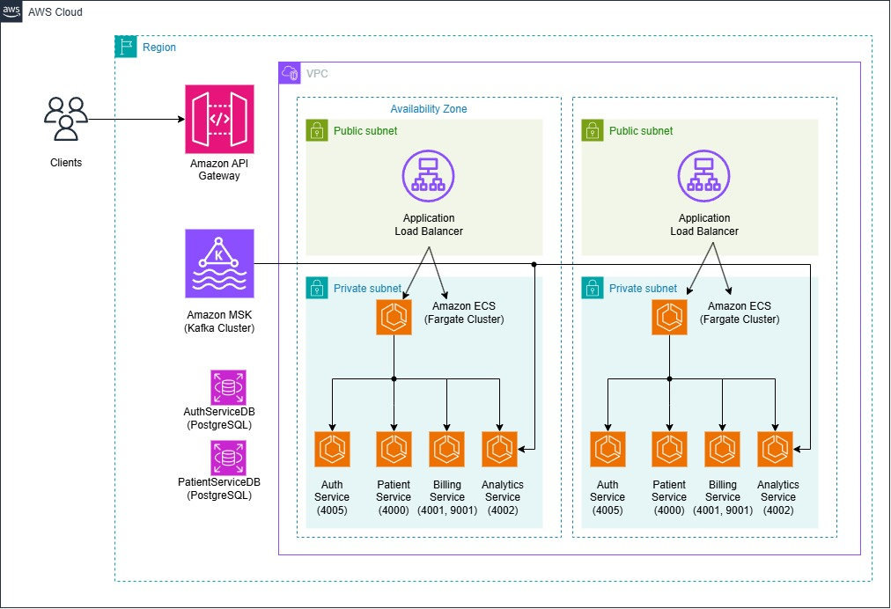
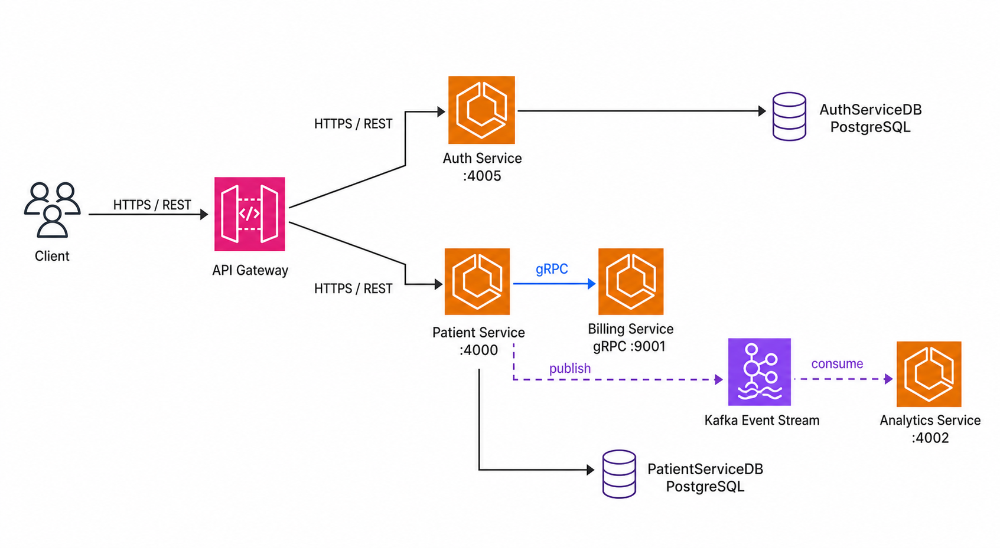

# Patient Management
Built with Java Spring Boot, patient management is an API system that allows hospitals to manage their
patients. Features include billing, user management, analytics, and authentication.

## Infrastructure architecture

## Microservice communication flow

